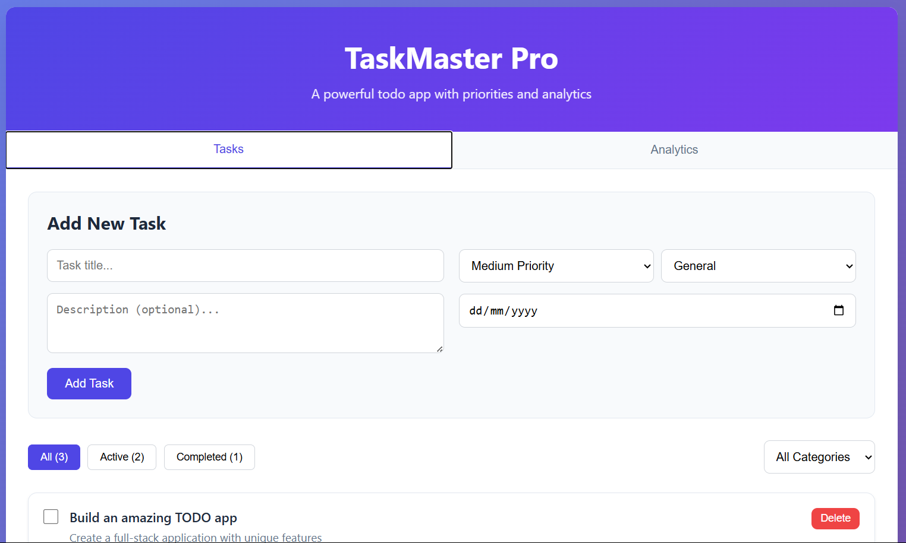

# 📝 Simple Todo App

A lightweight and responsive Todo application built with **HTML**, **CSS**, and **JavaScript**.  
It allows users to manage tasks efficiently — with added features like **task priorities** and **completion analytics**.

---

## 🚀 Live Demo  
👉 [Click here to try it out](https://simptodo.netlify.app/)

---

## ✨ Features

- ✅ Add and remove todos
- 📌 Mark todos as completed
- 🔥 Assign priority levels (e.g. High, Medium, Low)
- 📊 Task analytics (total tasks, completed, pending)
- 📱 Fully responsive design
- 💾 Persistent data using **Local Storage** (if you implemented it)

---

## 📸 Preview

 <!-- Optional: add a real screenshot of your app -->

---

## 🛠 Built With

- **HTML5**
- **CSS3** (Flexbox/Grid for layout)
- **Vanilla JavaScript (ES6+)**

---

## 📂 Folder Structure

